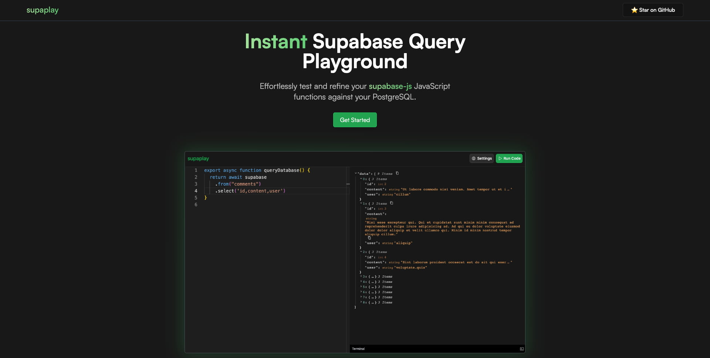

<div align="center">
   <a href="https://supaplay.vercel.app/" target="_blank">
      
   </a>
</div>

## Introduction

Supaplay is a playground to effortlessly test and refine your `supabase-js` JavaScript functions against your PostgreSQL thanks to the power
of WebContainer API.

## Features

### Zero Setup

Supaplay Playground is all set up for you. No need to configure IDEs or dependencies. Just provide your Supabase keys and start testing your queries instantly.

### Interactive Query Testing

Write and execute queries using Monaco editor and get JSON-formatted results. This makes it easy to integrate the results of your queries into your own applications.

### WebContainer API Magic

Experience the power of WebContainerAPI, running Node.js in your browser. Effortlessly harness its capabilities to create, edit, and run code seamlessly.

## Stack

- [Vite + React + TypeScript](https://vitejs.dev)
- [TailwindCSS](https://tailwindcss.com)
- [Radix UI](https://www.radix-ui.com)
- [WebContainer API](https://webcontainers.io)
- [Monaco Editor for React](https://www.npmjs.com/package/@monaco-editor/react)
- [Routing - wouter](https://github.com/molefrog/wouter)
- [Deployment - Vercel](https://vercel.com/)

## Development

1.Clone the repo:

```sh
git clone https://github.com/xavimondev/supaplay.git
```

2.Install dependencies:

```sh
# pnpm:
pnpm install
# npm:
npm install
# yarn:
yarn install
```

2.Start the development mode:

```sh
# pnpm:
pnpm dev
# npm:
npm run dev
# yarn:
yarn dev
```

3.Finally open [http://localhost:5173](http://localhost:5173)

## Contributing

You can contribute by adding new features, fixing bugs, improving logic code, etc. All the contributions you make are really appreciated.

1.[Fork](https://github.com/xavimondev/supaplay/fork) the repo.

2.Create a branch:

```sh
git switch -c newfeature
```

3.Commit and push your changes:

```sh
git commit -am 'Add a new feature'
git push origin newfeature
```

4.Open a Pull Request
